# Frame-Classification Annotation Process

## Übersicht

Dieses Dokument beschreibt den vollständigen Prozess der manuellen Frame-Classification für Brexit-Debatten, von der intelligenten Chunk-Erstellung bis zur kollaborativen Annotation durch mehrere Annotatoren.

## 🎯 Ziel

Erstellung eines annotierten Datensatzes für das Fine-Tuning von LLMs zur automatischen Frame-Classification politischer Texte.

## 📊 Prozess-Übersicht

```mermaid
graph TD
    A[Gefilterte Brexit-Datenbank] --> B[Intelligentes Chunking]
    B --> C[20% Zufällige Auswahl]
    C --> D[User-Zuweisung]
    D --> E[Manuelle Annotation]
    E --> F[Training-Daten]
    
    B --> G[Semantic Chunking]
    G --> H[~100-150 Wörter pro Chunk]
    
    C --> I[Zufällige Auswahl]
    I --> J[Reproduzierbare Ergebnisse]
    
    D --> K[5 Annotatoren]
    K --> L[Gleichmäßige Verteilung]
    
    E --> M[6 Frame-Kategorien]
    E --> N[Web-basiertes Interface]
```



## 🔧 Technische Implementierung

### 1. Intelligentes Chunking

**Script**: `scripts/simple_database_chunking.py`

**Methode**: Semantic Chunking mit spaCy
- **Linguistisch korrekte Satzgrenzen**
- **Optimale Chunk-Größe**: 100-150 Wörter
- **Kontext-Erhaltung**: Semantische Kohärenz
- **Fallback-Mechanismen**: NLTK + Regex

**Ausgabe**:
- Neue Datenbank: `debates_brexit_chunked.duckdb`
- Tabelle: `chunks` mit allen Metadaten
- Vollständige Indizierung für Performance

### 2. Zufällige Auswahl (20%)

**Algorithmus**:
```python
# 20% der Chunks für Annotation
annotation_count = int(total_chunks * 0.2)

# Zufällige Auswahl mit reproduzierbarem Seed
random.seed(42)
selected_chunk_ids = random.sample(all_chunk_ids, annotation_count)
```

**Eigenschaften**:
- **Reproduzierbar**: Seed=42 für konsistente Ergebnisse
- **Zufällig**: Gleichmäßige Verteilung über alle Reden
- **Skalierbar**: Funktioniert mit beliebiger Anzahl Chunks

### 3. User-Zuweisung

**Annotatoren**: Max, Julian, Lina, Julius, Rike

**Verteilung**:
```python
# Gleichmäßige Verteilung
chunks_per_annotator = annotation_count // len(annotators)
remainder = annotation_count % len(annotators)

# Rest wird gleichmäßig verteilt
for i, annotator in enumerate(annotators):
    chunks_for_annotator = chunks_per_annotator
    if i < remainder:
        chunks_for_annotator += 1
```

**Datenbank-Update**:
```sql
UPDATE chunks 
SET assigned_user = ? 
WHERE chunk_id = ?
```

## 🏷️ Frame-Kategorien

### Definierte Kategorien

1. **Human Impact** - Auswirkungen auf Menschen
2. **Powerlessness** - Gefühl der Machtlosigkeit
3. **Economic** - Wirtschaftliche Aspekte
4. **Moral Value** - Moralische Werte
5. **Conflict** - Konflikte und Spannungen
6. **Other** - Sonstige Kategorien

### Annotation-Guidelines

**Human Impact**:
- Gesundheit, Sicherheit, Lebensqualität
- "This will affect millions of people..."
- "Families will suffer..."

**Powerlessness**:
- Gefühl der Ohnmacht, fehlende Kontrolle
- "We have no choice but to..."
- "The government is forcing us..."

**Economic**:
- Geld, Handel, Arbeitsplätze, Wirtschaft
- "This will cost billions..."
- "Jobs will be lost..."

**Moral Value**:
- Ethik, Gerechtigkeit, Werte
- "This is morally wrong..."
- "We have a duty to..."

**Conflict**:
- Streit, Opposition, Widerstand
- "This will cause division..."
- "People are fighting..."

## 🌐 Streamlit Annotation Interface

### Features

**User-Management**:
- Jeder User sieht nur seine zugewiesenen Chunks
- Persistente Session-Verwaltung
- Automatisches Speichern

**Annotation-Interface**:
- **Chunk-Anzeige**: Vollständiger Text mit Metadaten
- **Frame-Auswahl**: Dropdown mit 6 Kategorien
- **Notizen**: Optionales Textfeld für Kommentare
- **Navigation**: Vorheriger/Nächster Chunk

**Admin-Features**:
- **Fortschritts-Tracking**: Live-Statistiken
- **User-Übersicht**: Alle Zuweisungen und Fortschritt
- **Export-Funktionen**: CSV/JSON Download

### Interface-Struktur

```
📝 Annotation Tab
├── Chunk-Informationen (ID, Speaker, Wörter)
├── Chunk-Text (Vollständiger Text)
├── Frame-Auswahl (Dropdown)
├── Notizen (Textfeld)
└── Navigation (Speichern, Nächster, Vorheriger)

📊 Statistiken Tab
├── Gesamt-Chunks
├── Annotierte Chunks
├── Frame-Verteilung (Chart)
└── User-Statistiken

👥 Admin Tab
├── User-Fortschritt
├── Zuweisungs-Übersicht
├── Fortschritts-Charts
└── Gesamt-Statistiken

📥 Export Tab
├── CSV-Download
├── JSON-Download
└── Backup-Funktionen
```

## 📋 Annotation-Workflow

### Für Annotatoren

1. **Login**:
   - Name eingeben (Max, Julian, Lina, Julius, Rike)
   - "Chunks laden" klicken

2. **Annotation**:
   - Chunk-Text lesen
   - Frame-Kategorie wählen
   - Notizen hinzufügen (optional)
   - "Speichern" klicken

3. **Navigation**:
   - "Nächster" für nächsten Chunk
   - "Vorheriger" für vorherigen Chunk
   - Direkte Navigation zu bestimmten Chunks

4. **Pausieren**:
   - Jederzeit pausieren möglich
   - Fortschritt wird automatisch gespeichert
   - Später an gleicher Stelle weitermachen

### Für Admins

1. **Übersicht**:
   - Admin-Tab öffnen
   - Fortschritt aller User verfolgen
   - Statistiken und Charts anzeigen

2. **Monitoring**:
   - Welcher User arbeitet an was
   - Wie viele Chunks sind annotiert
   - Frame-Verteilung über alle User

3. **Export**:
   - CSV/JSON Download für Backup
   - Training-Daten für Fine-Tuning
   - Qualitätskontrolle

## 🗄️ Datenbank-Schema

### Chunks-Tabelle

```sql
CREATE TABLE chunks (
    chunk_id VARCHAR PRIMARY KEY,           -- Eindeutige ID
    speech_id VARCHAR NOT NULL,             -- Referenz zur Rede
    debate_id VARCHAR,                      -- Referenz zur Debatte
    speaker_name VARCHAR,                   -- Name des Sprechers
    speaker_party VARCHAR,                  -- Partei/Amt des Sprechers
    debate_title VARCHAR,                   -- Titel der Debatte
    debate_date DATE,                       -- Datum der Debatte
    chunk_text TEXT NOT NULL,               -- Chunk-Text
    chunk_index INTEGER NOT NULL,           -- Index innerhalb der Rede
    total_chunks INTEGER NOT NULL,          -- Gesamt-Chunks in der Rede
    word_count INTEGER NOT NULL,            -- Anzahl Wörter
    char_count INTEGER NOT NULL,            -- Anzahl Zeichen
    chunking_method VARCHAR NOT NULL,       -- Chunking-Methode
    assigned_user VARCHAR,                  -- Zugewiesener Annotator
    frame_label VARCHAR,                    -- Annotierte Frame-Kategorie
    annotation_confidence INTEGER,          -- Confidence-Level
    annotation_notes TEXT,                 -- Annotator-Notizen
    created_at TIMESTAMP DEFAULT CURRENT_TIMESTAMP,
    updated_at TIMESTAMP DEFAULT CURRENT_TIMESTAMP
);
```

### Indizes

```sql
CREATE INDEX idx_chunks_speech_id ON chunks(speech_id);
CREATE INDEX idx_chunks_debate_id ON chunks(debate_id);
CREATE INDEX idx_chunks_speaker ON chunks(speaker_name);
CREATE INDEX idx_chunks_assigned_user ON chunks(assigned_user);
CREATE INDEX idx_chunks_frame_label ON chunks(frame_label);
```

## 📊 Statistiken und Monitoring

### Chunk-Statistiken

- **Gesamt-Chunks**: Anzahl aller erstellten Chunks
- **Annotierte Chunks**: Anzahl annotierter Chunks
- **Zugewiesene Chunks**: Anzahl zugewiesener Chunks
- **Unzugewiesene Chunks**: Anzahl nicht zugewiesener Chunks

### User-Statistiken

- **Chunks pro User**: Anzahl zugewiesener Chunks
- **Fortschritt**: Annotierte vs. zugewiesene Chunks
- **Prozent**: Fortschritts-Prozentsatz
- **Frame-Verteilung**: Welche Frames wurden annotiert

### Qualitätskontrolle

- **Konsistenz-Checks**: Mehrfach-Annotation für Validierung
- **Inter-Annotator Agreement**: Übereinstimmung zwischen Annotatoren
- **Outlier-Detection**: Ungewöhnliche Annotationen identifizieren

## 🚀 Deployment und Nutzung

### Setup

1. **Datenbank-Chunking**:
   ```bash
   python scripts/simple_database_chunking.py
   ```

2. **Streamlit starten**:
   ```bash
   python start_annotation_db.py
   ```

3. **Browser öffnen**:
   ```
   http://localhost:8501
   ```

### Nutzung

1. **User-Login**: Name eingeben
2. **Chunks laden**: Eigene Chunks laden
3. **Annotation**: Frame-Kategorien zuweisen
4. **Monitoring**: Fortschritt verfolgen
5. **Export**: Training-Daten exportieren

## 📈 Erwartete Ergebnisse

### Chunk-Verteilung

- **Gesamt-Chunks**: ~267,593 (alle Reden)
- **Annotation-Chunks**: ~53,519 (20%)
- **Chunks pro User**: ~10,704 (gleichmäßig verteilt)

### Zeitaufwand

- **Chunking**: ~5-10 Minuten
- **Annotation pro Chunk**: ~30-60 Sekunden
- **Gesamt-Annotation**: ~450-900 Stunden
- **Pro User**: ~90-180 Stunden

### Qualität

- **Semantische Kohärenz**: Bessere Chunks durch intelligentes Chunking
- **Konsistente Annotation**: Reproduzierbare Zuweisungen
- **Vollständige Metadaten**: Alle notwendigen Informationen
- **Skalierbare Architektur**: Einfache Erweiterung möglich

## 🔄 Nächste Schritte

1. **Annotation durchführen**: Alle User annotieren ihre Chunks
2. **Qualitätskontrolle**: Inter-Annotator Agreement berechnen
3. **Training-Daten generieren**: Export für Fine-Tuning
4. **LLM Fine-Tuning**: Modell auf annotierten Daten trainieren
5. **Evaluation**: Modell-Performance auf Test-Daten

## 📚 Dokumentation

- **Chunking-Methoden**: `docs/CHUNKING_METHODS.md`
- **Annotation-Process**: `docs/ANNOTATION_PROCESS.md`
- **README**: `README.md` mit Setup-Anweisungen

---

*Erstellt: Oktober 2024*  
*Projekt: Brexit-Debatten Frame-Classification*  
*Status: Implementiert und bereit für Annotation*
